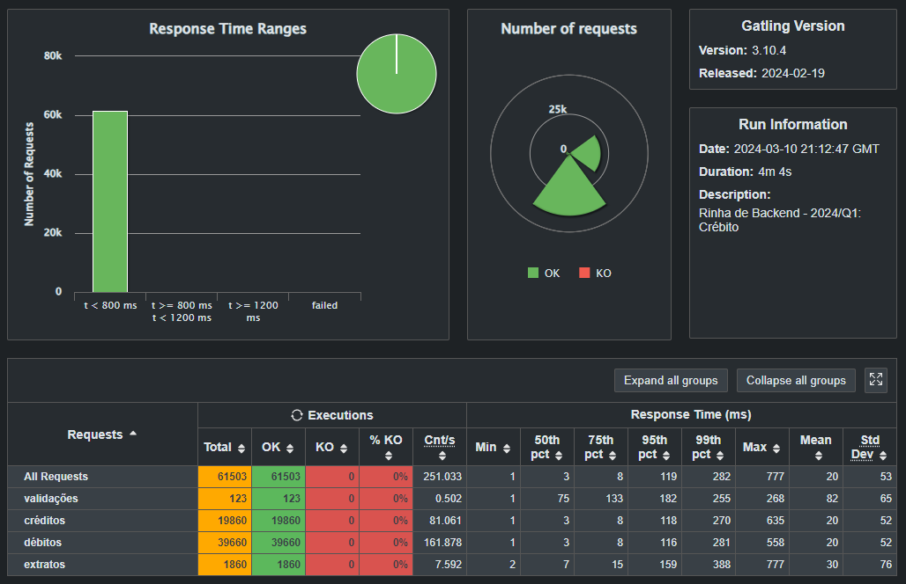

# Esquilo Aniquilador


> 🐿 Minha API aniquiladora pra segunda edição da Rinha de Backend em Go. A Rinha de Backend é uma competição muito divertida e, para mim, toda edição é/será de muito aprendizado. Participa aí!

> [!TIP]
> Veja [o repositório da Rinha](https://github.com/zanfranceschi/rinha-de-backend-2024-q1). O prazo final é 10/03/2024.

## 🗺 O que foi implementado

Inicialmente:

- [x] Rota `POST /clientes/:id/transacoes` com banco de dados em memória (para testes e validação das regras de negócio)
- [x] Rota `GET /clientes/:id/extrato` com banco de dados em memória (só faltou fazer a ordenação decrescente por data/hora)

Posteriormente/atualmente:

- [x] Rota `GET /clientes/:id/extrato` com banco de dados PostgreSQL
- [x] Rota `POST /clientes/:id/transacoes` com Postgres

A imagem do `Dockerfile` está disponível no Docker Hub: [kauefraga/esquilo-aniquilador-api](https://hub.docker.com/repository/docker/kauefraga/esquilo-aniquilador-api/general).

Minha submissão para a Rinha de Backend está [aqui](https://github.com/zanfranceschi/rinha-de-backend-2024-q1/tree/main/participantes/kauefraga-golang).

## ⬇ Como instalar e botar pra fu...ncionar

1. Clone o repositório
2. Rode `go run cmd/api/main.go`

O segundo passo já deve instalar as dependências. Caso contrário, rode `go mod download` e execute a segunda instrução de novo.

```bash
# (1)
git clone https://github.com/kauefraga/esquilo-aniquilador.git
cd esquilo-aniquilador

# (2)
go run cmd/api/main.go

# (3?)
go mod download
```

## 🧪 Como rodar os testes

### Testes Gatling

Dá uma olhada no [repositório principal](https://github.com/zanfranceschi/rinha-de-backend-2024-q1), meu mano! Especialmente [aqui](https://github.com/zanfranceschi/rinha-de-backend-2024-q1?tab=readme-ov-file#ferramenta-de-teste).

Veja os resultados do último teste que rodei:



### Testes unitários

Pra que isso?! 🤡

### Testes para verificar as regras de negócio (manual mesmo)

Requisitos: [Visual Studio Code](https://code.visualstudio.com).

1. Instale a extensão [REST Client](https://marketplace.visualstudio.com/items?itemName=humao.rest-client)
2. Abra o arquivo `requests.http`
3. Certifique-se de que o banco de dados e a API estejam rodando
4. Clique em `Send Request`, faça isso para cada requisição descrita/que aparece

```bash
# (1)
code --install-extension humao.rest-client

# (2)
code . # Esteja dentro do diretório esquilo-aniquilador (raiz), que você clonou
```

## 🧙‍♂️ O que tunei e como

Não tunei nada, mal implementei o necessário 🤣.

## 🌳 Interações

### Redes Sociais

- [Meu Twitter/X](https://twitter.com/rkauefraga)
- [Rinha de Backend](https://twitter.com/rinhadebackend)

### Meus tweets/xweets

- [Início](https://twitter.com/rkauefraga/status/1757072132729639271)
- [Sobre a regra de negócio que retorna 422](https://twitter.com/rkauefraga/status/1757524333629464861)
- [Sobre o README desse projeto](https://twitter.com/rkauefraga/status/1757606382570782877)
- [Quando terminei a rota de extrato](https://twitter.com/rkauefraga/status/1757870172969246833)
- [Começo do fim](https://twitter.com/rkauefraga/status/1766865225473524221)
- [Fiz o teste passar 100% OK mas com uma latência miserável](https://twitter.com/rkauefraga/status/1766918566425612487)
- [Quando terminei os testes com 100% OK e uma latência agradável](https://twitter.com/rkauefraga/status/1766939474020167970)
- [Finalmente](https://twitter.com/rkauefraga/status/1766954158010052674)

## 📝 Licença

Este projeto está sob licença do MIT - Veja a [LICENÇA](https://github.com/kauefraga/esquilo-aniquilador/blob/main/LICENSE) para mais informações.

---

Feito com ❤ por Kauê Fraga Rodrigues.
